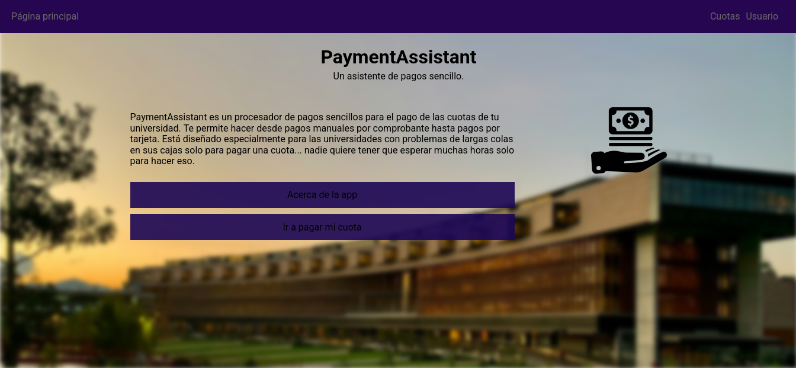

# PaymentAssistant

This is a project that I made for a exhibition that was not used for anything else.

## Description 

It's a Flask application for a fee payment system. Was going to serve as an automation for a university.

Others libraries used here are in [requirements.txt](/requirements.txt). The frontend only uses vanilla HTML/CSS/JS and some libs like aos.js.

The main language of the page is spanish.

## It is useful?

No, actually is not.

As it is, the system would just pass the physical queues to pay fees to virtual ones. That's why I published it as an archive. I was going to add the actual automation of fee payments with cards, but as the university didn't care about the project... well.

So; it's just here as a memory and project to show my code quality. (is regular, I would say)

## Running

Just clone the repository with `git clone https://github.com/Vz0n/PaymentAssistant`, install dependencies with `pip install -r requirements.txt` and run `python run.py`.